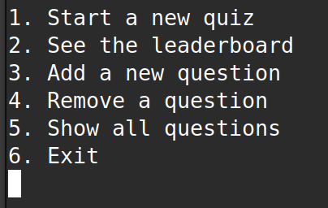
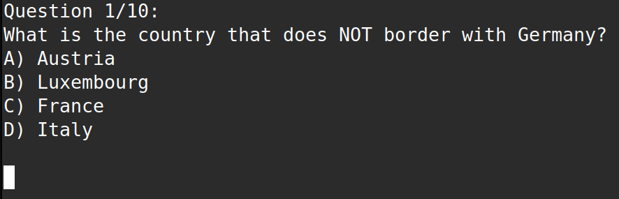

# Terminal-Quiz-with-SQLite3
User can play a quiz with random questions, add or remove questions and see the list of all questions

- Start a new quiz with randomly selected questions
- Add new questions to the database
- Remove existing questions
- View all stored questions
- Display results after the quiz ends

## Requirements

- C compiler (e.g., `gcc`)
- SQLite3 (library and CLI)

## Compilation

```bash
gcc main.c -lsqlite3 -o main
```

## Running

./main

## Screenshots

Menu:


Sample question:

